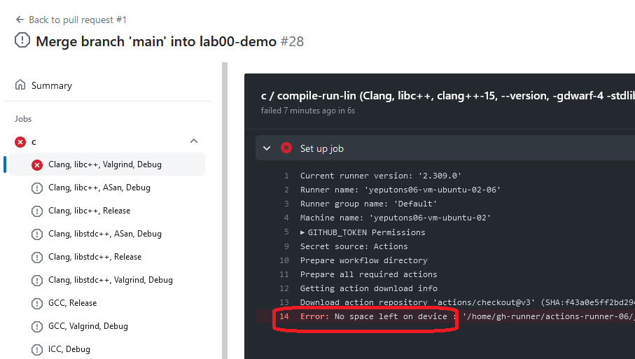
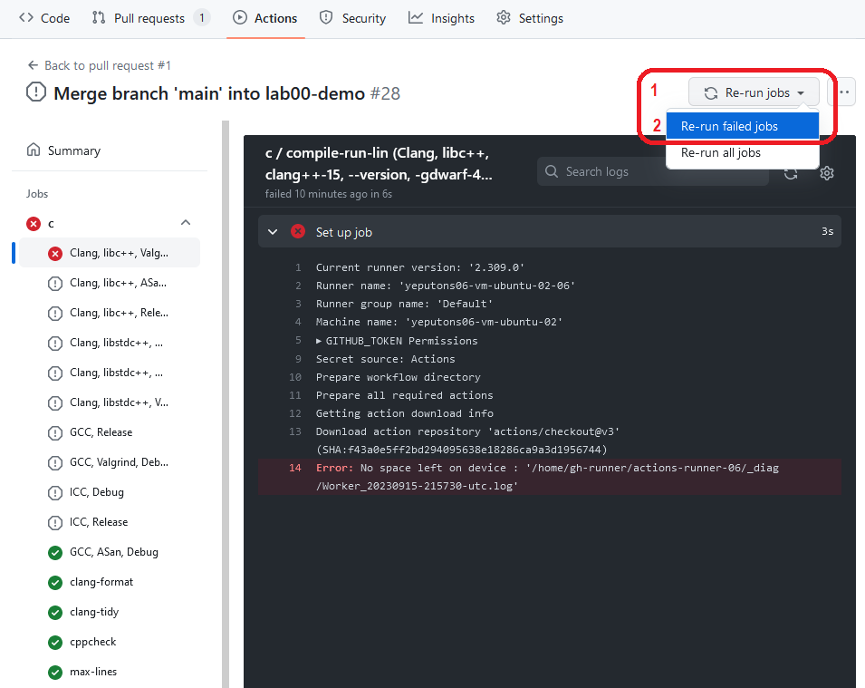

# Стандартные требования
Ваше решение будет проверяться в том числе автоматически, список автопроверок приведён ниже.
Решения, не проходящие хоть одну автопроверку на GitHub Actions, получают ноль баллов.
Другими словами, проверяйте, что напротив вашего последнего коммита в ветке стоит зелёная галочка,
а не красный крестик (какая-то проверка не прошла) или жёлтая точка (проверка идёт).

Зелёная галочка означает лишь прохождение открытых автопроверок.
Ещё есть секретные тесты, которые проверяющие вручную запускают у себя, они не приводят к автоматическому нулю.

Если вам кажется, что какая-то проверка слишком строгая, работает неверно или противоречит написанному в этом файле — напишите.
Вы можете посмотреть фактически запускаемые проверки в папке `.github/workflows` вашего репозитория
или на странице с конкретным запуском GitHub Actions (проще: уже видны прям точные команды).

Вопросы по заданию в целом следует задавать практику (не проверяющему).
Вопросы по конкретно своему коду — проверяющему.

## Открытые тесты
Ваше решение должно проходить все предоставленные вам автоматические тесты
независимо от используемого компилятора.
Тесты бывают двух видов, в каждом задании может быть несколько видов сразу.

1. Автоматический тест для консольного приложения.
   Обычно это bash-скрипт или Python-скрипт `run-test-data`, который принимает в качестве единственного параметра
   командной строки команду, запускающую скомпилированное приложение: `./main`, не просто `main`.
   Скрипт должен завершиться с кодом возврата 0 без ошибок и вывести в конце `ALL PASS`.
2. Юнит-тесты.
   Находятся в исходных файлах с именами вроде `*_test.*` или `tests.cpp`, компилируются определённым
   в задании образом и должны завершаться без ошибок.
   Обычно также требуется добавить в проект лежащий рядом файл `doctest_main.cpp`.

В некоторых домашних заданиях можно решить лишь часть подзадач, а остальные тесты
отключить определённым образом, читайте условие.

## Автоматические проверки
Ложноположительные срабатывания статического анализа можно и нужно подавлять (suppress).
Также можно подавлять, если инструмент не понял ваш замысел и замысел того стоит.
Не уверены — обсудите с проверяющим.

Ниже для примера предполагается, что решение состоит из файлов `main.cpp`, `other.cpp`, `other.hpp`.

### Статический анализ
* Точное соответствие стилю кода; запуск [`clang-format`](https://clang.llvm.org/docs/ClangFormat.html) не должен менять исходные файлы:
  ```bash
  clang-format -i main.cpp other.cpp other.hpp
  ```
  * Для настроек используется файл `.clang-format` из корня этого репозитория.
* Должны отсутствовать предупреждения статического анализатора [`clang-tidy`](https://clang.llvm.org/extra/clang-tidy/)
  при запуске следующей команды (она использует файл `.clang-tidy` из корня репозитория):
  ```
  clang-tidy main.cpp other.cpp other.hpp
  ```
  * Для настроек используется файл `.clang-tidy` из корня этого репозитория.
  * Для каждой папки с заголовками также передаётся параметр `-extra-arg=-I<путь-до-папки-с-заголовками>`.
  * Так как `clang-tidy` не поддерживает язык Си, файлы с расширениями `*.c` и `*.h` не проверяются.
  * Ложноположительные срабатывания заглушайте при помощи `// NOLINT(....)` или `// NOLINTNEXTLINE(...)`.
    * Запрещается опускать скобки и заглушать вообще все предупреждения на конкретной строке.
  * Для файлов с юнит-тестами добавляется флаг `--checks=-readability-function-cognitive-complexity` для отключения одной из проверок.
* Должны отсутствовать предупреждения статического анализатора [`cppcheck`](http://cppcheck.sourceforge.net)
  при запуске следующей команды:
  ```
  cppcheck -DSOME_DEFINE_TO_FIX_CONFIG --enable=all --suppressions-list=cppcheck-suppressions.txt --error-exitcode=1 --inline-suppr main.cpp other.cpp
  ```
  * Для каждой папки с заголовками также передаётся параметр `-I<путь-до-папки-с-заголовками>`.
  * Заголовочные файлы `.hpp`/`.h` проверяются в составе соответствующих единиц трансляции `.cpp` и в списке параметров отдельно не передаются.
  * Файлы `.c` не передаются вообще, потому что cppcheck не поддерживает Си.
  * Файл `cppcheck-suppressions.txt` лежит в папке с заданием.
  * Ложноположительные срабатывания заглушайте при помощи `// cppcheck-suppress`.
* Количество строк в решении не превышает указанное в задании.

### Компиляция и запуск
Автоматические тесты запускаются под несколькими операционными системами через GitHub Actions на наших собственных серверах.

Всегда добавляются флаги компилятора для стандарта C++20 и трактовки всех предупреждений как ошибок:

* Для GCC, Clang: `-std=c++20 -pedantic-errors -Wall -Wextra -Werror`
* Для Visual Studio: `/std:c++20 /W4 /WX`

Также для GCC/Clang C++ Compiler Classic переключаются режимы Debug/Release:

* Для обычной компиляции добавляются флаги компилятора:
  * Debug: `-g` (включение отладочной информации)
  * Release: `-O3 -NDEBUG` (включение оптимизаций и удаление отладочного кода)
* Для CMake добавляются флаги при вызове `cmake`: `-DCMAKE_BUILD_TYPE=Debug` и `-DCMAKE_BUILD_TYPE=Release`, соответственно.

Под Ubuntu:

* Используется каждый из трёх компиляторов с флагами:
  * `g++-12` со стандартной библиотекой `libstdc++`: без дополнительных флагов
  * `clang++-15` со стандартной библиотекой `libstdc++` (режим по умолчанию): `-stdlib=libstdc++`
  * `clang++-15` со стандартной библиотекой `libc++`: `-stdlib=libc++`
  * При этом для Clang всегда добавляется ключ `-gdwarf-4`, [иначе получается чуть-чуть несовместимый с Valgrind бинарник](https://bugs.kde.org/show_bug.cgi?id=452758).
* Используются три режима компиляции и запуска:
  * Debug-режим с включённым UBSan и запуск через Valgrind (инструмент memcheck):
    * Добавляются флаги `-fsanitize=undefined -fno-sanitize-recover=all -DEXPECT_VALGRIND` (последний используется в некоторых наших тестах, это не стандартная опция)
    * Вместо `./main foo bar` запускается `valgrind --quiet --leak-check=full --error-exitcode=123 ./main foo bar`
  * Debug-режим с включёнными UBSan и ASan:
    * Добавляются флаги `-fsanitize=undefined -fno-sanitize-recover=all -fsanitize=address -DEXPECT_ASAN` (последний используется в некоторых наших тестах, это не стандартная опция)
  * Release-режим без sanitizer и valgrind
* Дополнительно проверяется корректность работы в Intel C++ Compiler Classic в Debug/Release режимах
  * В обоих режимах добавляется флаг `-diag-disable=2196` для подавления [небольшой несовместимости с doctest](https://github.com/doctest/doctest/pull/555#discussion_r773959095)
  * В обоих режимах добавляется флаг `-diag-disable=10441` для подавления [предупреждения об устаревании](https://www.intel.com/content/www/us/en/developer/articles/release-notes/oneapi-c-compiler-release-notes.html)
* Итого под Linux используется `3*3+2=11` режимов компиляции и запуска.

Под macOS используется Apple Clang в режимах, аналогичных Ubuntu: Debug с UBSan и ASan, Release.

Под Windows используется Visual Studio Community в Debug/Release режимах, каждый в 32-битном и 64-битном режиме, итого 4 комбинации режимов:

* Всегда добавляются флаги компилятора:
  * `/permissive-` — отключение некоторых расширений Visual C++ и несоответствий стандарту
  * `/EHsc` — совместимая со стандартом C++ обработка исключений, автоматически включается CMake.
  * `/D_CRT_SECURE_NO_WARNINGS` — отключение предупреждений, рекомендующих использовать безопасный аналог `scanf_s` вместо `scanf` (они есть в стандарте, но не поддерживаются никем, кроме Visual Studio).
* Для обычной компиляции добавляются флаги компилятора:
  * Debug:
    * `/Zi` — включение отладочной информации в отдельном `.pdb`-файле
    * `/RTC1` — включение некоторых проверок использования локальных переменных вроде UBSan
    * `/MDd` — использование отладочной версии стандартной библиотеки
  * Release:
    * `/O2` — включение оптимизаций
    * `/D NDEBUG` — удаление отладочного кода
    * `/MD` — использование релизной версии стандартной библиотеки
* Для CMake добавляются флаги при вызове `cmake --build`: `-config Debug` и `--config Release`, соответственно.

### Версии
Таким образом, имеется четыре обязательных проверки на стиль и качество кода, а также `11+2+2*2=17` комбинаций компилятора и режима запуска.
В каждой сомбинации все открытые тесты должны проходить.

По умолчанию используются последние 64-битные версии, доступные в Ubuntu 22.04:
* `g++-12 (Ubuntu 12.3.0-1ubuntu1~22.04) 12.3.0`
* `Ubuntu clang version 15.0.7`
* `cmake version 3.22.1`
* `Ubuntu clang-format version 15.0.7`
* `clang-tidy`: `Ubuntu LLVM version 15.0.7`
* `Cppcheck 2.7`
* `valgrind-3.18.1`

При тестировании Visual Studio используются почти последние 64-битные и 32-битные версии, доступные в Windows 2022 Server Core:
* `cmake version 3.27.2`
* `Оптимизирующий компилятор Microsoft (R) C/C++ версии 19.38.33140`

При тестировании Apple Clang используются последние 64-битные версии, доступные в macOS Sonoma 14.6.1 под процессоры M1:
* `cmake version 3.30.3`
* `Apple clang version 15.0.0 (clang-1500.3.9.4)`

Если требуются какие-либо сторонние библиотеки, они должны быть подключены в `CMakeLists.txt`
через соответствующий стандартный `find_package`.
Обычно это уже сделано за вас в задании.
Нужные библиотеки на проверяющих машинах уже установлены так, чтобы CMake их находил:
под Ubuntu ставятся версии из репозиториев Ubuntu,
под Windows ставятся версии из vcpkg и настраивается переменная среды `CMAKE_TOOLCHAIN_FILE`,
под macOS ставятся версии из Brew.

Размер стека оставлен по умолчанию: под Ubuntu/macOS регулируется ОС (8 мегабайт), под Windows регулируется компилятором (у Visual Studio 1 мегабайт).
Это не должно существенно влиять на решения, если влияет — пишите преподавателям.

### Популярные проблемы
#### Отменяются запуски GitHub Actions
На странице конкретного запуска может быть написано и просто `The operation was canceled.` в середине запуска или даже `This check was cancelled` вместо логов.

Найдите причину отмены: зайдите на вкладку "Summary" над списком запусков и прокрутите в самый низ, там в конце раздела Annotations
будут запуски, которые отменялись первыми, рядом с каждоым написана причина.

Если написано "Canceling since a higher priority waiting request for '...' exists" — значит, появился более свежий коммит в той же ветке.
Для уменьшения нагрузки на тестирующую систему тестирование старых отменяется.

Если написано `The job running on runner ..... has exceeded the maximum execution time of 5 minutes.` или
`The operation was canceled.` ([без указания причины](https://github.com/orgs/community/discussions/40582)),
то ваш запуск наверняка превысил допустимое время работы (обычно 5 минут).
Если запуск не виснет, а просто долго работает (например, статический анализ) — оповестите об этом
лектора со ссылкой на код.
Скорее всего, проверяющей системе плохо, не перезапускайте проверку, станет только хуже.

Если написано `The job was canceled because "....." failed.`, то тестирование под конкретным компилятором
отменено, потому что не прошло что-то другое.
Достаточно одной ошибки, чтобы отменить всё тестирование.
Ищите первоисточник ошибки.

#### Ошибка `No space left on device`
Если вы видете вот такую ошибку (может быть как при компиляции в `Set up job`, так и при запуске теста, так и вообще при любой проверке):



То у проверяющей системы серьёзные проблемы.
Сообщите об этом лектору.
Не перезапускайте проверку, чтобы не стало хуже.

#### Зависает только под Visual Studio в отладочном режиме и только на сервере
Это может быть симптомом run-time error.

Причина: в отладочном режиме Visual Studio компилирует с кучей проверок (примерно как `_GLIBCXX_DEBUG`),
но при падении `assert` или каких-то ещё проверок (вроде обращения к пустому `std::optional`) вылезает окно с кнопками и ждёт реакции от пользователя.
На сервере их никто не нажимает, получаем превышение времени работы.
Чтобы заменить их на вывод в консоль, надо в начале работы программы настроить Visual Studio (и только его), это делается
через функцию `_CrtSetReportMode` и похожих на неё.
В решении-заглушке этот код обычно уже написан, равно как и при использовании `doctest.h`.

#### Все тесты падают с ошибкой `cannot execute binary file: Exec format error` или похожей
Скорее всего, вы закоммитили в репозиторий скомпилированное приложение, после чего сервер попытался его выполнить.
Удалите это прииложение и добавьте соответствующую строчку в свой `.git/config/exclude`, чтобы больше нельзя было добавить через `git add`.

Особенно красиво взрывается, если:

1. Закоммитить Linux'овый бинарник с именем `main` (без расширения).
2. Виндовый сервер собирает бинарник с именем `main.exe`.
3. Виндовый сервер запускает Bash-скрипт для автопроверки.
4. В Bash-скрипте для совместимости между разными ОС написано `./main`: под линуксом так и надо, а под виндой Bash добавляет `.exe` автоматически.
   Но только если нет файла `./main` без расширения, а вы как раз его закоммитили.
5. Винда пытается запустить линуксовый бинарник и у неё не получается.

### Перезапуск тестов по просьбе преподавателя
В случае массовых проблем у проверяющей системы преподаватели могут попросить вас перезапустить проверку.
**Не перезапускайте просто так** если тесты не прошли; скорее всего у вас неверное решение.
Можете попросить подсказку преподавателя.

Для перезапуска нажмите сначала на кнопку 1 (`Re-run jobs`), а потом выберите кнопку 2 (`Re-run failed jobs`):



Появится всплывающее окно, нажмите зелёную кнопку `Re-run jobs`.

## Неавтоматические проверки
Непрохождение проверок ниже не обнуляет баллы автоматически, но проверяющие за ними следят.

1. Помните про аттрибут `[[nodiscard]]`.
1. Помните про возможность пометить некоторые конструкторы как `explicit`.
1. Помните про `noexcept`.
1. В некоторых заданиях файлы `.cpp` и `.hpp` разделены по папкам: `.cpp` в `src/`, а `.hpp` — в `include/`, тогда:
    * Сохраняйте такую структуру
    * Запрещается упоминать имена этих папок в исходном коде, требуется корректно настроить пути поиска компилятора, чтобы работало `#include "foo.hpp"`
1. Если используете forward-заголовки, то в файле `foo.hpp` находятся определения классов и объявления функций, в файле `foo_fwd.hpp` — forward declaration классов.
    * Определения `enum` — на ваше усмотрение, но в `_fwd` они могут оказаться полезнее.

# Формат сдачи
Для каждого домашнего задания вы должны создать ровно один Pull Request в своём закрытом репозитории `labs-<ваш-ник>`
в организации `hse-spb-2024-cpp` из ветки с определённым именем в ветку `main`.
Ветка `main` должна быть синхронизирована с общим репозиторием `all-labs`.
Автопроверки запускаются как GitHub Actions, а специальный пользователь @yeputons-bot проверит
базовую корректность оформления Pull Request.

Время сдачи считается как время последней загрузки данных (push) в ветку с заданием на GitHub.
Вы можете увидеть его, наведя мышь на подсказку вроде "Triggered via push 25 minutes ago" на странице с запуском GitHub Actions.
Разрешается сколько угодно попыток сдачи, однако не следует излишне нагружать тестирующую систему.
Проверки могут выполняться уже после дедлайна, но если они не пройдут, вы уже не сможете исправить и получите ноль баллов.

До дедлайна вы можете делать сколько угодно попыток, просто загружаете новую версию в ветку с работой,
создавать новый PR не требуется.
Проверяется только последний коммит в Pull Request, если нет другой договорённости с принимающим.
Если хотите экспериментировать — создайте отдельную ветку.
Переключать ветку для проверки после дедлайна уже нельзя.

**Никогда не нажимайте кнопку Merge** в Pull Request.

При уважительных причинах дедлайны можно индивидуально двигать, пишите принимающему или лектору.

## Требования к Pull Request
Решения, нарушающие любое из требований ниже, получают ноль баллов.

* Base-ветка — `main`, причём последний коммит должен:
  * в точности совпадать с одним из коммитов общего репозитория `all-labs`, в том числе по номеру (совпадения содержимого недостаточно) и
  * совпадать или быть после последнего коммита, изменяющего содержательную часть задания.
* Head-ветка — `labXX-YYYY`, где `XX` — двузначный номер домашнего задания, а `YYYY` — его кодовое название на латинице.
  Например: `lab01-executor`.
* Название Pull Request: ваши ФИО полностью на кириллице, запятая, пробел, название ветки.
  Например: `Суворов Егор Федорович, lab01-executor`.
* На вкладке Files Changed должны быть только относящиеся к конкретному заданию изменения.
    * В частности, запрещено добавлять лишние файлы в Pull Request: с настройками IDE, исполняемые, временные, логи выполнения.
      Если указано в задании, можно добавлять свои тесты.
* Запрещено добавлять несколько решений в Pull Request.
* Все автоматические проверки должны проходить, включая одобрение от @yeputons-bot.

### Популярные проблемы
* В заголовке Pull Request есть лишние пробелы: в начале, в районе запятой, в конце.
  Отредактируйте заголовок.
* Вы случайно изменили ветку `master`, например, нажав кнопку Merge.
  Тогда её надо сбросить при помощи `git reset --hard` (опасно!).
  Если вы не уверены — попросите практика помочь.
* Вы выбрали не те ветки при создани Pull Request.
  Закройте его и откройте новый.
* Вы добавили лишние файлы.
  Удалите их.

## Рецензирование кода
После сдачи ваше решение будет проверено принимающим.
Обсуждение кода будет в комментариях к Pull Request.
Не нажимайте "Resolve conversation", если вы не автор исходного комментария.

По договорённости с принимающим часть обсуждения может происходить вне Pull Request.

Исправления требуется делать в той же ветке и в том же Pull Request.
Запрещается переписывать историю, например, при помощи `push --force`.

## Исправление проблем
Если вам кажется, что что-то сломалось, напишите своему практику (не принимающему) как можно скорее.

# Система оценки
* Задание оценивается в 10 баллов: 6 за корректность, 4 за стиль.
  * Если не проходит хотя бы одна автопроверка или неверно назван PR, вы получаете ноль.
  * Вы не можете получить за стиль больше баллов, чем за корректность.
* Вы можете сдать любой префикс частей и получить баллы в соответствии с таблицей из условия.
  Например, если вы сдали подзадачи 1, 2, 4, то вы можете получить только баллы
  за подзадачи 1-2.
* В каждой подзадаче можно получить частичные баллы как за корректность, так и за стиль, однако это не гарантируется.
  Даже незначительный баг может случайно снизить балл до нуля, если он влияет на вообще все секретные тесты;
  но это редкость.
* Так как части взаимосвязаны, баллы на стиль могут распределяться между частями нечётко.
  Например, выполнение новой части может случайно испортить стиль или корректность преыдущей.

# Честность
Основное: **весь код должен быть написан исключительно вами самостоятельно**, но обсуждать теорию и синтетические примеры можно.

Запрещается привлекать кого угодно для помощи с домашками, кроме лектора, практиков и проверяющих (за исключением ситуаций ниже).
Репетиторов тоже нельзя — лучше попросить дополнительную пару, это норм.

Запрещается публиковать или передавать за пределы вашего курса (или более старших курсов нашей программы) и условия, и решения задач.
Если вам хочется что-то указать в резюме — вы можете кратко описать задание и свои успехи текстом или выложить кусочек кода (не целиком!)
в приватный https://gist.github.com, получить рандомную негуглящуюся ссылку, а потом удалить.
Пожалуйста, уважайте труд преподавателей: на разработку первой версии одного домашнего задания легко может
уйти полная рабочая неделя в сорок часов, после чего задание каждый год улучшается в деталях.

## Частные случаи
### Обсуждения без кода
Можно и нужно обсуждать друг с другом, преподавателями и кем угодно:

* Содержимое лекций
* Не связанные с домашкой куски кода, вроде "нет ли UB в этой программе?" или "за сколько работает `vector::push_back` в каких случаях?"
* Настройку среды разработки, запуск компиляторов, отладчиков, и анализаторов
* Вопросы на StackOverflow
* Чисто алгоритмическую часть заданий по C++, вообще не зависящую от языка программирования, вроде "какую структуру данных надо использовать, чтобы работало за линию вместо квадрата"

Следует спрашивать напрямую у своего практика (лектора, проверяющего — если практик недоступен), чтобы получить надёжную информацию:

* Вопросы по условию
* Подсказки

Не рекомендуется обсуждать ни с кем, кроме лектора, практиков или проверяющих:

* Проблемы в своём конкретном коде. Например, скриншот решения во флудилке можно списать, и случайно получить эквивалентное решение
* Детали реализации алгоритмов, вроде "как лучше назвать эту переменную" или "какой инвариант тут лучше сделать"

### Переиспользование кода
Можно использовать в своих решениях:

* Код из лекций, упражнений, практик, своих старых решений, с доски на практике
* Самостоятельно написанный вами код

Не рекомендуется (но и не запрещается) использовать:

* Искусственный интеллект (ChatGPT, GitHub CoPilot, и тому подобное): с высокой вероятностью код получится крайне странным и совпадёт с чьим-то ещё решением.
  К тому же отлаживать чужой код обычно сильно сложнее, чем свой

Очень не рекомендуется использовать:

* Куски кода из интернета больше нескольких строк или которые вы не понимаете полностью — такие куски кода могут случайно совпать между разными студентами
* Код из решений похожих задач из интернета — аналогично

## Последствия
Как минимум у всех участников (включая давшего списать, даже если случайно) полностью зануляется соответствующее задание, и запрещается его дорешивание в конце семестра.
Сверх этого — по ситуации.
